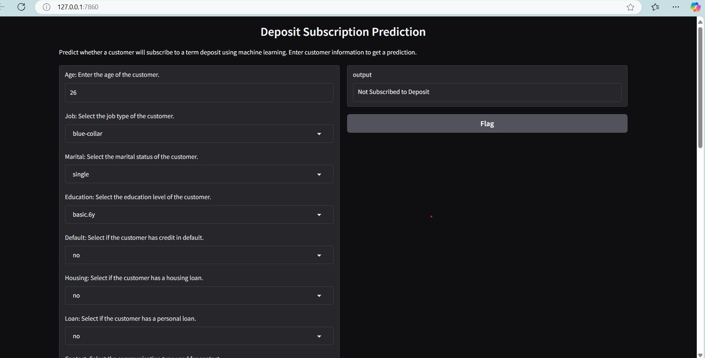
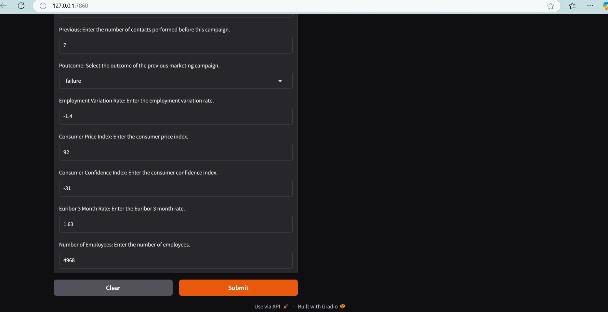

# 🚀 Banking Term Deposit Rate  👍 👎 💰 📈

This project aims to develop a predictive model to determine the likelihood of a client subscribing to a term deposit. The model leverages operational data, with the target variable "y" indicating whether the client subscribes ("yes") or not ("no"). By analyzing the dataset's features, the goal is to build an effective model that assists the business in understanding client behavior and making informed decisions to achieve its objectives.

<!--  -->
<!--  -->


<!--  -->
[](https://huggingface.co/my-awesome-ml-web-app)
[](https://github.com/ellerbrock/open-source-badges/)


## About This Project 📊

🎓 Data Analytics Project with [Azubi Africa](https://www.azubiafrica.org/data-analytics)
The objective is to build an accurate predictive model that helps the business target potential clients, optimize marketing efforts, and improve customer engagement. The project involves data preprocessing, exploratory analysis, model building, and optimization to provide actionable insights for decision-making.

## Preview 👁️

Below is a preview showcasing the app's interface.




👉❗ [Gradio App is available for interaction on this url](https://huggingface.co/spaces/gr8testgad-1/Term_Deposit_Predictions)





<!-- 👉❗ [Streamlit App is available for interaction on this url](http://localhost:8501) ❗ -->

## Notable Feature 
- **Data Collection:** Gathered a balanced dataset of movie reviews with sentiment labels.
- **EDA:** Conducted comprehensive exploratory data analysis to gain insights.
- **Data Preprocessing:** Leveraged NLP tools to clean and prepare text data for modeling.
- **Model Training:** Trained various machine learning models for sentiment classification.
- **Model Evaluation:** Assessed model performance with accuracy, precision, recall, and more.
- **Hyperparameter Tuning:** Optimized models using grid search and cross-validation.
- **App Deployment:** Deployed a user-friendly sentiment analysis app on Gradio.
- **Docker Containerization:** Containerized the app for easy distribution and deployment.

## Setup 🛠️

To set up and run the project:

1. **Clone the repository**:
   ```bash
   git clone '<https://github.com/Israel-Anaba/Bank_Marketing_Campaign>'
   ```

```

2. Navigate to the project directory:

   ```bash
   cd movie-sentiment-analysis
```

3. Create a virtual environment (optional but recommended)
   It's recommended to isolate project dependencies, which helps prevent conflicts with system-wide Python packages.:

   ```bash
   python -m venv venv
   ```
4. Activate the virtual environment:

   - On Windows:
     ```bash
     venv\Scripts\activate
     ```
   - On macOS and Linux:
     ```bash
     source venv/bin/activate
     ```
5. **Install project dependencies:**

   ```bash
   pip install -r requirements.txt
   ```
6. Explore the Jupyter notebooks for data analysis, model training, and experimentation.

7. Run the Gradio app for real-time sentiment analysis:

   ```bash 
      python src/app.py
   ```
<!-- 8. Run the Streamlit app for real-time sentiment analysis: -->

<!-- ```bash -->
<!-- #    streamlit run src/app_streamlit.py -->

<!-- ``` -->

🚥 NOTE: You can run the notebooks outside the venv


## Usage 🚀

1. **Launch the Gradio App:** Start the Gradio app by running `python app.py`.
2. **Analyze Reviews:** Input for Term Deposit Subcription predictions.
3. **Customize and Experiment:** Modify hyperparameters, customize the pipeline, or fine-tune models to suit your needs.

<!-- ## Dockerization 📦 -->

<!-- First create a Dockerfile, check documention : [Docker Official Documentation - Dockerfile reference](https://docs.docker.com/engine/reference/builder/)

Dockerize the application with the following commands:

```bash
# Build the Docker image
docker build -t movie-sentiment-prediction-app .

# Run the Docker container
docker run -p 7860:7860 --name movie-review-sentiment movie-sentiment-prediction-app
``` -->

## Deployment 🌐

The APP was further deployed on huggingface. You can interact with the app via huggingface following the steps below.

- To access the moview review sentiment prediction app, you will need to be signed in to Hugging Face:

1. If you don't have a Hugging Face account, you can sign up for free at .
   [Hugging Face](https://huggingface.co/signup).
2. After signing in, you can access the app using the link below:
   🔔 ❗🤖[Term-Deposit-Analysis-Gradio](https://huggingface.co/spaces/gr8testgad-1/Term_Deposit_Predictions)❗
   <!-- 🔔 ❗🤖[Movie-Review-Analysis-Streamlit](https://huggingface.co/spaces/gr8testgad-1/Movie-Review-Sentiment-Roberta)❗ -->

Please note that you need to be signed in to Hugging Face to utilize this service. If you encounter any issues or have questions, feel free to checkout the huggingface documentation [Huggingface Documentation](https://huggingface.co/docs) for assistance.


## Author 📖 🧑‍🎓

This project was developed as a project for the Azubi Africa Data Science. Find in the provided link an article covering interesting findings from the different Projects.

| Name                | Article                                                                                                                                                                                  |
| ------------------- | ---------------------------------------------------------------------------------------------------------------------------------------------------------------------------------------- |
| Israel Anaba Ayamga | [Medium](https://israelanaba.medium.com/) |


## Contributing 🤝

Contributions are welcome! Feel free to open an issue or submit a pull request.


## Resources 📚

Here are a few recommended resources to help you gain a solid understanding of the frameworks used in the project:

❗[Get started with Gradio](https://gradio.app/getting_started/)

<!-- ❗[Get started with Streamlit](https://docs.streamlit.io/) -->

❗[Get to know about Hugging Face](https://huggingface.co/)

<!-- ❗[More on Docker](https://www.docker.com/) -->


## License 📜

This project is open-source and available under the [MIT License](LICENSE).

Feel free to reach out to us with any questions or feedback!

📧 Contact: [Israel Anaba Ayamga](officialanaba@gmail.com)


<!-- ## Acknowledgement 🥇

I would like to express my gratitude to the [Azubi Africa Data Analyst Program](https://www.azubiafrica.org/data-analytics) for their support and for offering valuable projects as part of this program. Not forgeting my scrum masters on this program [Rachel Appiah-Kubi](https://www.linkedin.com/in/racheal-appiah-kubi/) & [Emmanuel Koupoh](https://github.com/eaedk)


## License 📜

This project is open-source and available under the [MIT License](LICENSE).

Feel free to reach out to us with any questions or feedback!

📧 Contact: [Israel Anaba Ayamga](officialanaba@gmail.com)


